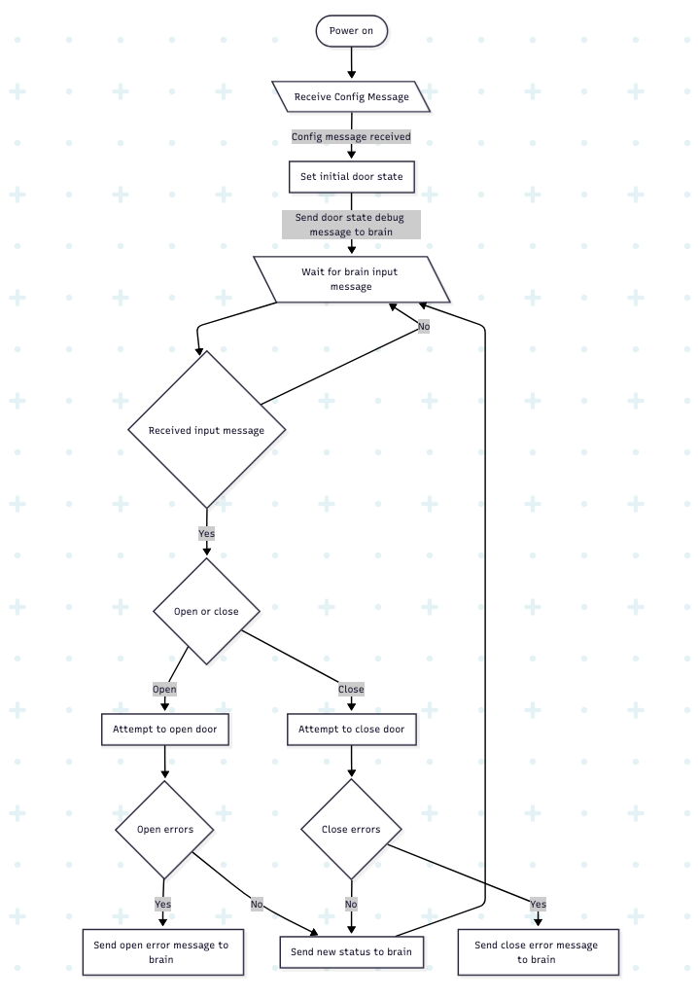
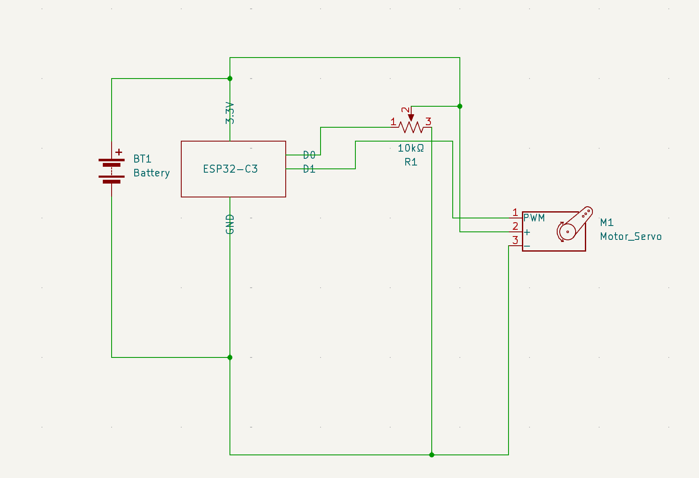

# Door Actuator

## User Story

[GitHub Issue #8](https://github.com/ComputerScienceUniversityofDenver/S25-EmbeddedSecuritySystem/issues/8)

## Messages

**Set the speed at which the door opens or closes, and set open threshold**  

```json
{"mtype":"config", "from":"does_not_matter", "to":"recipient_unique_id", "name":"door-speed", "value":"fast"}  
{"mtype":"config", "from":"does_not_matter", "to":"recipient_unique_id", "name":"door-speed", "value":"slow"}  
{"mtype":"config", "from":"does_not_matter", "to":"recipient_unique_id", "name":"open-threshold", "value":500} 
```

**Set the initial door status to open or closed**  

```json  
{"mtype":"config", "from":"brain", "to":"door_actuator", "name":"initial-door-status", "value":"closed"}  
{"mtype":"config", "from":"brain", "to":"door_actuator", "name":"initial-door-status", "value":"open"}  
```

**Tell the brain if the door is open or closed**  

```json  
{"mtype":"debug", "from":"door_actuator", "to":"brain", "name":"door-status", "value":"open"}  
{"mtype":"debug", "from":"door_actuator", "to":"brain", "name":"door-status", "value":"closed"}  
```

**If the door fails to close, send a failure message that includes how far the door closed or opened as an integer representing a percentage**  

```json  
{"mtype":"error", "from":"door_actuator", "to":"brain", "name":"door-close-failure", "value":0}  
{"mtype":"error", "from":"door_actuator", "to":"brain", "name":"door-open-failure", "value":0}
```

**Messages from the brain that tell the door to open or close**  

```json  
{"mtype":"door_actuator.close", "from":"brain", "to":"door_actuator", "name":"close-door", "value":true}  
{"mtype":"door_actuator.open", "from":"brain", "to":"door_actuator", "name":"close-door", "value":false} 
```

## Software Description  

## review doc + edited 
Software Description

The software sets the initial state of the door (open or closed) and how fast it should move. It waits for commands from the brain to open or close the door. When a command is received, it actuates the servo accordingly,  sends status updates back to the brain, and reports any failure if the door can't fully move.

This implementation uses a rotary encoder to simulate control over the servo angle, mapping encoder ticks to servo rotation from 30° to 130° using PWM. Button press state is also printed for debugging.

## Software Design  



## review doc + edited (added correct hardware connections)
## Hardware Connections  

ESP32 Microcontroller Reads encoder inputs and sends PWM to control servo motor. All logic and processing are handled by this board. Rotary Encoder (SunFounder) Connected to D2 (SW), D3 (DT), and D4 (CLK). It simulates user control over the door. Rotation adjusts servo angle; the button can later be mapped to a manual open/close trigger. Servo Motor (TowerPro MG90S)
Connected to D5 for signal. Receives PWM from the ESP32 and physically rotates to simulate door opening or closing. Together, the encoder provides angle input, and the servo responds to those inputs through PWM, simulating door movement.

## review doc + edited (added correct pins)
## Pin Connections

- Rotary Encoder SW → D2  
- Rotary Encoder DT → D3  
- Rotary Encoder CLK → D4  
- Servo Signal → D5  
- Servo VCC → 3.3V  
- Servo GND → GND


## SVG link to activity Diagram

https://www.mermaidchart.com/raw/f4f3f330-93e1-432e-8494-39d714603b84?theme=light&version=v0.1&format=svg  

## Hardware Diagram  



## Updated Documentation

### Refinements to Specification
- Added door-open-failure error detection logic based on openThreshold value.
- Enhanced handling of commands from brain with JSON parsing for door_actuator.open and door_actuator.close.

### Additional Hardware Considerations
- The door actuator module uses a servo connected to SERVO_PIN, driven with precise pulse width signals.
- Encoder pins ENC_DT and ENC_CLK are configured with interrupts to detect door movement.

### Known Limitations
- position variable simulates open/close instead of actual actuator limits or feedback.
- No timeout or fail-safe handling for hardware failures; relies on encoder interrupts and simulated movement.
- Brain commands simulate movement without actual actuation beyond servo angle control.

## Test Cases

### Configuration Tests

#### T-CONFIG-01: Set Door Speed to Slow
- **Input:**
```json
{"mtype":"config","from":"brain","to":"door_actuator","name":"door-speed","value":"slow"}
```
#### T-CONFIG-02: Set Open Threshold

- **Input:**
```json
{"mtype":"config","from":"brain","to":"door_actuator","name":"open-threshold","value":"500"}
```
- **Expected Output:**
 Config stored, used for error detection.

#### T-CONFIG-03: Initial Door Status Config

- **Input:**
```json
{"mtype":"config","from":"brain","to":"door_actuator","name":"initial-door-status","value":"closed"}
```
- **Expected Output:**
 Config stored, initial status set.

## input Message Tests

#### T-INPUT-01: Open Door Command

- **Input:**
```json
{"mtype":"door_actuator.open","from":"brain","to":"door_actuator","name":"close-door","value":"false"}
```
- **Expected Output:**
```json
{"mtype":"debug","from":"door_actuator","to":"brain","name":"door-status","value":"open"}
```
#### T-INPUT-02: Close Door Command

- **Input:**
```json
{"mtype":"door_actuator.close","from":"brain","to":"door_actuator","name":"close-door","value":"true"}
```
- **Expected Output:**
```json
{"mtype":"debug","from":"door_actuator","to":"brain","name":"door-status","value":"closed"}
```
## Error Handling Tests

#### T-ERROR-01: Door Close Failure

- **Input:**
 Door stops moving, position < 10.
- **Expected Output:**
```json
{"mtype":"error","from":"door_actuator","to":"brain","name":"door-close-failure","value":X}
```
#### T-ERROR-02: Door Open Failure

- **Input:**
 Door stops moving, position < openThreshold.
- **Expected Output:**
```json
{"mtype":"error","from":"door_actuator","to":"brain","name":"door-open-failure","value":X}
```
#### T-ERROR-03: Malformed JSON Message
- **Input:**
```json
{ "bad json message" }
```

DONE BY AMRIT:
## Redis Integration
## Redis Connectivity Module
This system module leverages Redis to handle configuration data and facilitate real-time inter-module communication. This module supports integration with Redis to enable configuration management and real-time system communication. Two Redis features drive this process: Hash Sets and Publish/Subscribe. 
## Hash Sets Overview
Redis Hashes provide a mapping between string keys and values, enabling organized, structured data storage akin to a dictionary or lightweight JSON format. In this module, Hash Sets are essential for managing parameters like system thresholds, refresh intervals, and device states. They support efficient retrieval and updates of these configurations.
## Publish/Subscribe Messaging

Redis’s Pub/Sub model creates a communication pipeline where messages are “published” to channels and instantly received by any “subscribers” monitoring those channels. This setup is ideal for broadcasting system updates, distributing configuration changes, or dispatching diagnostics data across multiple components.

## Summary
I completed the tesing module and installed Redis Integration Setup.

## REDIS MESSAGE
INFO: validate config for 'config:door_actuator' : {'threshold': '10', 'speed': 'fast', 'direction': 'open'}

