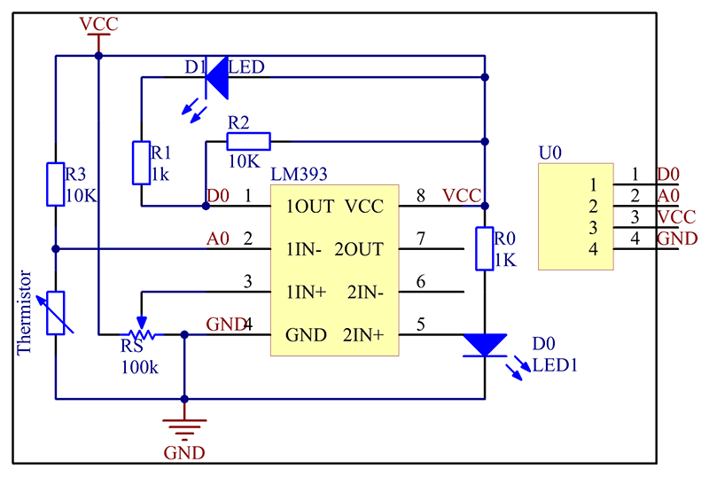

# Environment Sensor

## User Story

a.) Take ambient temp reading with no one in the room and detect light initially.
b.) Get reading from sensors.
c.) Changes in heat (fires) that spike above a few degrees. Changes in light, if there is a lack of power or fire producing more or less. Changes have to vary by a further margin for these to trigger.

This will be implemented in the embedded/environment_sensor folder.

For hardware this will use a photoresistor for light, and this sensor for temperature: https://www.sunfounder.com/products/analog-temperature-sensor-module

https://github.com/ComputerScienceUniversityofDenver/S25-EmbeddedSecuritySystem/issues/4

## Table of Contents
- [Overview](#overview)
- [Input Messages](#input-messages)
- [Output Messages](#output-messages)
- [Acknowledgement Messages](#acknowledgement-messages)
- [Hardware Connections](#hardware-connections)
- [Software Design](#software-design)
- [Test Cases](#test-cases)
- [Known Limitations](#known-limitations)


## Overview
The environment sensor contains two seperate sensors, a photoresistor and a temperature sensor. Each sensor has a state in ["running","stopped","alarm"]. There will be a baseline threshold embedded in the code since we are mainly detecting fires and light. A threshold for each sensor above and below the baseline is set within the code. If a sensor is running, it compares its current reading to the threshold and enters alarm state if it excedes or goes below the threshold and continually messages the brain that a sensor is in alarm mode. There will be acknowledge messages to ensure massages have been sent.

This module monitors ambient light and temperature using:
- **Photoresistor** for light detection (D0)
- **Analog thermistor** for temperature detection (D2)
- **LED** indicator for alarm (D7)

If the light sensor reading is above 800, it’s considered **light on**. If the temperature reading is above 50°C, it’s considered **fire detected**. LED will turn off if there is a fire detected or depending if there is light or not. Basically the LED turning off indicates that there is an issue

## Configuration Parameters


This module does take configuration parameters such as start or starting each setup alone. Thresholds are fixed in firmware, unless changed by the user. All measurements are hardcoded and already established withing the code, since we are mainly detecting on and off light and if there is a fire or not which ultimately doesn't need to be calibrated. Yet in the case if need be, user can input the config message to change the thresholds of each device.

| mtype                        | Command         | Description                                  |
|------------------------------|-----------------|----------------------------------------------|
| `config` | `start`         | Start both sensors                           |
| `config` | `start_temp`    | Start temperature sensor only                |
| `config` | `start_light`   | Start light sensor only                      |
| `config` | `temp_threshold`         | Sets the fire alarm temperature threshold (°C).                          |
| `config` | `light_threshold`    | Sets the light alarm ADC threshold.               |


**Example:**

- ```json{ "mtype": "config", "from": "brain", "to": "environment_sensor1", "command": "start" }```
- ```json{ "mtype": "config", "from": "brain", "to": "environment_sensor1", "command": "start_temp" }```
- ```json{ "mtype": "config", "from": "brain", "to": "environment_sensor1", "command": "start_light" }```
- ```json{ "mtype": "config", "from": "brain", "to": "environment_sensor1", "name": "temp_threshold", "value": 60.0 }```
- ```json{ "mtype": "config", "from": "brain", "to": "environment_sensor1", "name": "light_threshold", "value": 900 }```


## Input Messages

| mtype                        | Command         | Description                                  |
|------------------------------|-----------------|----------------------------------------------|
| `environment_sensor.command` | `stop`          | Stop both sensors                            |
| `environment_sensor.command` | `stop_temp`     | Stop temperature sensor only                 |
| `environment_sensor.command` | `stop_light`    | Stop light sensor only                       |
| `environment_sensor.get_status` | `temp_status`| Request current temperature                  |
| `environment_sensor.get_status` | `light_status`| Request current light ADC value              |

**Example:**

- ```json{ "mtype": "environment_sensor.command", "from": "brain", "to": "environment_sensor1", "command": "stop" }```
- ```json{ "mtype": "environment_sensor.command", "from": "brain", "to": "environment_sensor1", "command": "stop_temp" }```
- ```json{ "mtype": "environment_sensor.command", "from": "brain", "to": "environment_sensor1", "command": "stop_light" }```
- ```json{ "mtype": "environment_sensor.get_status", "from": "brain", "to": "environment_sensor1", "command": "temp_status" }```
- ```json{ "mtype": "environment_sensor.get_status", "from": "brain", "to": "environment_sensor1", "command": "light_status" }```


## Output Messages

| mtype                              | Name         | Description                                     |
|------------------------------------|--------------|-------------------------------------------------|
| `temp_sensor.alarm`                | `alarm`      | Sent when temperature exceeds fire threshold    |
| `light_sensor.alarm`               | `alarm`      | Sent when light exceeds light threshold         |
| `environment_sensor.temp_status`   | `temp_status`| Current temperature (°C)                        |
| `environment_sensor.light_status`  | `light_status`| Current light intensity (ADC)                   |
| `environment_sensor.error`         | `error`      | Error messages (e.g., malformed JSON)           |

**Examples:**

- ```json{ "mtype": "temp_sensor.alarm", "from": "environment_sensor1", "to": "*","name": "alarm", "value": "temp"}```
- ```json{ "mtype": "light_sensor.alarm", "from": "environment_sensor1", "to": "*", "name": "alarm", "value": "light"}```
- ```json{ "mtype": "environment_sensor.temp_status", "from": "environment_sensor1", "to": "*", "name": "temp_status", "value": 24.7 }```
- ```json{ "mtype": "environment_sensor.light_status", "from": "environment_sensor1", "to": "*", "name": "light_status", "value": 900 }```
- ```json{ "mtype": "environment_sensor.error", "from": "environment_sensor1", "to": "*", "name": "error", "value": "Deserialization failed"}```


## Acknowledgement Messages


### Config Acknowledgements

| Config Sent                        |Acknowledgement Output                                    |
|------------------------------------|--------------------------------------------------|
| ```"start" ```                            | ```json{ "mtype": "environment_sensor.ack", "from": "environment_sensor1", "to": "*", "name": "ack", "value": "start" }```        | 
| ```"start_temp"```                             | ```json{ "mtype": "environment_sensor.ack", "from": "environment_sensor1", "to": "*", "name": "ack", "value": "start_temp" }```        | 
| ```"start_light"```                              | ```json{ "mtype": "environment_sensor.ack", "from": "environment_sensor1", "to": "*", "name": "ack", "value": "start_light" }```         | 
| ```"temp_threshold"```                            | ```json{ "mtype": "environment_sensor.ack", "from": "environment_sensor1", "to": "*", "name": "ack", "value": "temp_threshold" }```         | 
| ```"light_threshold"```                             | ```json{ "mtype": "environment_sensor.ack", "from": "environment_sensor1", "to": "*", "name": "ack", "value": "light_threshold" }```        | 


### Device Acknowledgements

| Command Sent                        |Acknowledgement Output                                    |
|------------------------------------|--------------------------------------------------|
| ```"stop"```                              | ```json{ "mtype": "environment_sensor.ack", "from": "environment_sensor1", "to": "*", "name": "ack", "value": "stop" } ```       | 
| ```"stop_temp"```                              | ```json{ "mtype": "environment_sensor.ack", "from": "environment_sensor1", "to": "*", "name": "ack", "value": "stop_temp" }```        | 
| ```"stop_light"```                              | ```json{ "mtype": "environment_sensor.ack", "from": "environment_sensor1", "to": "*", "name": "ack", "value": "stop_light" }```         | 
| ```"temp_status"```                            | ```json{ "mtype": "environment_sensor.ack", "from": "environment_sensor1", "to": "*", "name": "ack", "value": "temp_status" }```         | 
| ```"light_status"```                             | ```json{ "mtype": "environment_sensor.ack", "from": "environment_sensor1", "to": "*", "name": "ack", "value": "light_status" }```        |  
 


## Hardware Connections

The Analog Temperature Sensor Module outputs analog readings through A0. Pin D0 on the temperature sensor will not be used in this project. The sensor uses a potentiometer that can physically be rotated to adjust the threshold. For our purposes we will just use the analog output and calculate if its an alarm value to allow for configuration of the threshold over software instead of mechanically.

A photoresistor will be used connected to an analog input to take measurements of the ambient light. Along with an LED to indicate if the systems is truly working or not

For a visual overview, refer to the diagrams below:

 


## Hardware Setup Summary

### Components Used:
- **LED** (Alarm Indicator)
- **Photoresistor** (Light Detection)
- **Analog Temperature Sensor** (NTC Thermistor)
- **ESP32 Board** (3.3V logic, 12-bit ADC)

### Pin Connections:
| Component             | Pin Name on Sensor   | ESP32 Pin Used |
|-----------------------|----------------------|----------------|
| Photoresistor         | Signal               | D0             |
| Analog Temp Sensor    | A0 (analog out)      | D1             |
| LED Output            | N/A                  | D7             |

### Test Summary:
- Detects light intensity above a set threshold (800)
- Detects spikes (>3°C from baseline) and alerts
- Detects fire-level heat (>55°C) and alerts via LED and serial
- Triggers alarm via digital pin if threshold comparator is tripped

### Issues:
**There were no hardware issues to note of.**

### Hardware Setup Photos:


## Software Design

### Functionality

The Environment Sensor will initialize with both sensors with configuration messages. The main loop will handle the logic according to the current state of each sensor (states of the two sensors are handled seperately). There will be additional functions to read the temperature and to read the photoresistor as well as calls within the sensor read functions to output message helper functions if an alarm is raised. The main loop will check for serial input messages, and the millis() function is used to ensure delays between sensor reads while still allowing other code to run.
 
- Periodic sampling every 1000ms  
- Threshold-based alarm triggers  
- JSON-based communication for commands, status, and errors  
- Non-blocking timing with `millis()`  
- Robust error handling for malformed JSON and unknown commands 
- Acknowledgement messages sent when needed

### Sensor States


- `Running` the sensor is being read and compared against the threshold and baseline. This comes after initial calibration or after a start command is inputted if state was stopped prior

- `Stopped` The main loop passes instead of taking sensor readings, but still checks for serial input in case of messages

- `Alarm` The loop continues to take readings and messages the brain every 1000ms while in this state //the rate at which the alarm message sends may need to be changed in conjunction with the brains logic. 1000ms is a starting point

### Diagram


## Test Cases

### Input Message Tests

| ID          | Description                     | Input Example                                                         | Expected Output / Behavior                                    |
|----------------------|---------------------------------|-----------------------------------------------------------------------|---------------------------------------------------------------|
| T-INPUT-01  | Start both sensors              | ```json{ "mtype": "environment_sensor.command", "from": "brain", "to": "environment_sensor1", "command": "start" }``` | Sensors resume normal reading for light and temperature      |
| T-INPUT-02  | Stop temperature sensor         | ```json{ "mtype": "environment_sensor.command", "from": "brain", "to": "environment_sensor1", "command": "stop_temp" }``` | Temperature sensor stops reading; light sensor continues     |
| T-INPUT-03  | Start temperature sensor only   | ```json{ "mtype": "environment_sensor.command", "from": "brain", "to": "environment_sensor1", "command": "start_temp" }``` | Temperature sensor resumes readings; light sensor unchanged  |
| T-INPUT-04  | Start light sensor only         | ```json{ "mtype": "environment_sensor.command", "from": "brain", "to": "environment_sensor1", "command": "start_light" }``` | Light sensor resumes readings; temperature sensor unchanged  |
| T-INPUT-05  | Stop both sensors               | ```json{ "mtype": "environment_sensor.command", "from": "brain", "to": "environment_sensor1", "command": "stop" }``` | Both sensors stop reading                                    |
| T-INPUT-06  | Stop light sensor only          | ```json{ "mtype": "environment_sensor.command", "from": "brain", "to": "environment_sensor1", "command": "stop_light" }``` | Light sensor stops; temperature sensor continues              |
| T-INPUT-07  | Get temperature status          | ```json{ "mtype": "environment_sensor.get_status", "from": "brain", "to": "environment_sensor1", "command": "temp_status" }``` | JSON status with current temperature in °C                    |
| T-INPUT-08  | Get light status                | ```json{ "mtype": "environment_sensor.get_status", "from": "brain", "to": "environment_sensor1", "command": "light_status" }``` | JSON status with current light ADC value                      |


### Error Handling

Below are examples of how the module responds to malformed or invalid JSON messages.

| ID          | Description                      | Input Example                                                 | Expected Output                                 |
|-------------|----------------------------------|---------------------------------------------------------------|--------------------------------------------------|
| T-ERROR-01       | Malformed JSON      | ```json{ "mtype": "environment_sensor.command", "command": "start"``` | ```json{ "mtype": "environment_sensor.error", "from": "environment_sensor1", "to": "*", "name": "error", "value": "Deserialization failed" }``` |
| T-ERROR-02  | Missing mtype/command fields     | ```json{ "from": "brain", "to": "environment_sensor1" }```            | ```json{ "mtype": "environment_sensor.error", "from": "environment_sensor1", "to": "*", "name": "error", "value": "Missing mtype or command" }``` |
| T-ERROR-03  | Unknown command                  | ```json{ "mtype": "environment_sensor.command", "from": "brain", "to": "environment_sensor1", "command": "explode" }``` | ```json{ "mtype": "environment_sensor.error", "from": "environment_sensor1", "to": "*", "name": "error", "value": "Unknown command" }``` |
| T-ERROR-04  | Message to different recipient   | ```json{ "mtype": "environment_sensor.command", "from": "brain", "to": "not_me", "command": "start" }``` | Silently ignored by environment_sensor1 |


## Known Limitations
- Thresholds (`25.0°C` fire, `800` light) are fixed in firmware. Unless commanded to change.
- Only 3 states for sensors: `running`, `stopped`, `alarm`.

