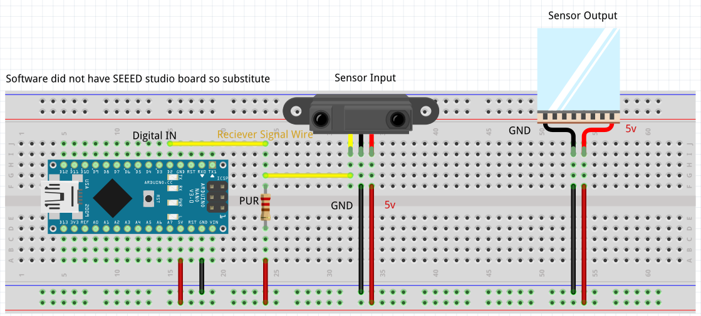
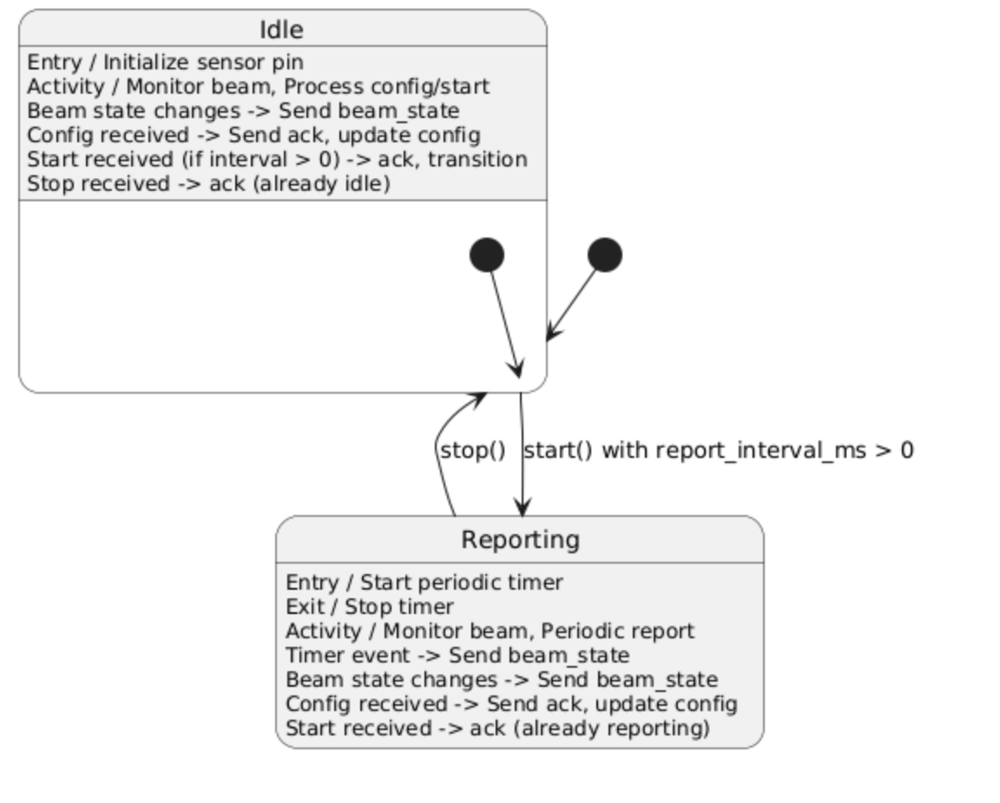
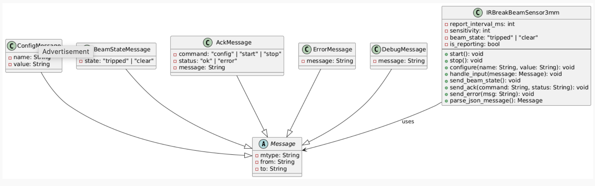

# IR Tripwire Sensor

A sensor to detect if signal interrupt occurs.

## Table of Contents

- [User Story](#user-story)
- [Configuration Parameters](#configuration-parameters)
- [Input Messages](#input-messages)
- [Output Messages](#output-messages)
- [Hardware Connections](#hardware-connections)
- [Software Design](#software-design)

## User Story

As a firmware developer, I want a configuration and calibration interface for the IR tripwire module So that I can adjust sensitivity, manage input/output behavior, and monitor status for reliable detection in embedded applications.

As an IR tripwire sensor module, I want to be configured and calibrated by the system that controls me, So that I can detect beam interruptions reliably and communicate my status accurately.

This document describes the specification, design, and documentation for the `IRBreakBeamSensor3mm` embedded module. This module utilizes an Adafruit 3mm IR Break Beam Sensor to detect the presence or absence of an object breaking the infrared beam between an emitter and a receiver. It functions as a sensing module, primarily reporting the state of the beam.

All communication with this module follows the standard JSON message format as described in the project guidelines, using newline characters as delimiters. All messages include the required `mtype`, `from`, and `to` keys.

Images and diagram source files referenced in this document will be located in the `./assets` sub-folder.

## Configuration Parameters

As required, this module accepts `config` messages to modify its behavior. Parameters are listed below. The format aligns with the general specification:

```json
{
  "mtype": "config",
  "from": "sender_unique_id",
  "to": "<this_module_unique_id>",
  "name": "parameter-name",
  "value": "parameter-value"
}
```

The IRBreakBeamSensor3mm module supports the following configurations parameters:
name: "report_interval_ms"

Description: Sets the interval (in milliseconds) for sending periodic beam state messages when the module is started via the .start command. A value of 0 or less disables periodic reporting, relying solely on reporting state changes.

Value: an int value casted as a string (for instance "0", "100")

name: "sensitivity:

Description: Sets the amount of times the sensor can be triggered before it reports an interrupt. Allows for the sensitivity of the sensor to be adjusted to reduce the amount of false positives.

## Input Messages

This module is primarily a sensor reporting it states, as configured the sensor will automatically be active after configured. As such there is no supported input messages.

## Output Messages

On_Change Message:

Description: Reports the current state of the infrared beam. This message is sent immediately when the beam state changes (from clear to tripped, or tripped to clear) and/or periodically if periodic reporting is enabled (after configured, report_interval_ms > 0).

```json
{
  "mtype": "IRBreakBeamSensor3mm.beam_state",
  "from": "<this_module_unique_id>",
  "to": "*",
  "state": "tripped" | "clear"
}
```

Example On_Change message --state clear

```json
{
  "mtype": "IRBreakBeamSensor3mm.beam_state",
  "from": "<this_module_unique_id>",
  "to": "*",
  "state": "clear"
}
```

Example On_Change message --state tripped

```json
{
  "mtype": "IRBreakBeamSensor3mm.beam_state",
  "from": "<this_module_unique_id>",
  "to": "*",
  "state": "tripped"
}
```

Acknowledgement Message:

Description: Sent in response to successfully processing a config, start, or stop input message.

```json
{
  "mtype": "IRBreakBeamSensor3mm.ack",
  "from": "<this_module_unique_id>",
  "to": "original_sender_id",
  "command": "config" | "start" | "stop",
  "status": "ok" | "error",
  "message": "Optional message detailing error or success"
}
```

Debug Messages:

Decription: Standard debug message for trouble shooting

```json
{
  "mtype": "debug",
  "from": "<this_module_unique_id>",
  "to": "*",
  "message": "<debug message contents>"
}
```

Error Messages:

Description: Standard error message if critical issue detected

```json
{
  "mtype": "error",
  "from": "<this_module_unique_id>",
  "to": "*",
  "message": "<error message contents>"
}
```

reveiwed doc :

## Hardware Overview

This Hello-World project demonstrates the use of a 3mm IR Break Beam Sensor to detect whether an object crosses a path. When the IR beam is broken, the sensor triggers an event which is used to simulate a "door open" condition. The system responds by turning on an LED and sending a debug message over serial to indicate the current door state ("open" or "closed").

The core components are:

- **IR Break Beam Sensor (3mm)** – detects if something interrupts the IR beam.
- **Seeed XIAO ESP32-C3** – microcontroller used to process the signal and communicate.
- **Internal Pull-Up Resistor** – either via software (`INPUT_PULLUP`) or external 10kΩ resistor.
- **Onboard LED (GPIO10)** – indicates the state: ON when beam is broken (door "open"), OFF otherwise.

## Pin Connections

| Component        | ESP32-C3 Pin        |
| ---------------- | ------------------- |
| IR Sensor Signal | D6                  |
| IR Sensor VCC    | 3.3V                |
| IR Sensor GND    | GND                 |
| External Pull-Up | Between D6 and 3.3V |
| Status LED       | 10                  |

## What the Sketch Does

- Initializes the IR sensor pin as `INPUT`.
- Continuously monitors the beam signal.
- On state change (beam broken or restored), it:
  - Updates the onboard LED.
  - Sends a JSON-formatted debug message to the "brain":
    - `"value": "tripped"` when the beam is broken
    - `"value": "clear"` when the beam is clear
- Also prints the current beam state periodically for monitoring.

## Challenges & Pitfalls

1. Internal Pull-Up Issues: Using INPUT_PULLUP caused incorrect readings. Resolved by 2. adding an external 10kΩ pull-up resistor between signal pin and 3.3V.
2. GPIO Mapping: The Seeed XIAO ESP32-C3 has labeled pins like D6, but actual GPIO mapping had to be verified in documentation.
3. Reverse Logic: The sensor outputs LOW when tripped; this required inverting logic in the code to correctly interpret “open” vs “closed”.
4. Accidental beam bouncing: Minor delays added to avoid noisy transitions when beam is quickly broken/restored.

## Hardware Connections

The module uses an Adafruit 3mm IR Break Beam Sensor set, consisting of an emitter and a receiver.

Components:

Adafruit 3mm IR Emitter

Adafruit 3mm IR Receiver

Emitter Connections:

Red Wire: Connect to Power (VCC). The sensor works from 3.3V to 5.5VDC, but 5V is recommended for optimal range (up to 25cm / 10"). Ensure this matches the Receiver's VCC.

Black Wire: Connect to Ground (GND).

Receiver Connections:

Red Wire: Connect to Power (VCC). Must match the Emitter's VCC (5V recommended).

Black Wire: Connect to Ground (GND).

White Wire (Signal): This is an open collector output. Connect to a Digital Input Pin on your microcontroller. A pull-up resistor is required. Most microcontrollers allow enabling an internal pull-up resistor on input pins in software. If internal pull-up is not used or available, connect a 10K Ohm resistor between the White wire and the Red wire (VCC). When the beam is clear, the signal pin will be pulled HIGH by the pull-up. When the beam is broken, the receiver pulls the signal LOW.

Power Requirements:

Voltage: 3.3V to 5.5V DC (5V recommended).

Emitter Current: ~10mA @ 3.3V, ~20mA @ 5V.

Receiver Current: Negligible operational current, but the output can sink up to 100mA probably

Total Current: Approximately 20-25mA at 5V when active.

Required Microcontroller Pins:

1x Digital Input Pin (configured with internal pull-up or external 10k pull-up resistor)

Access to VCC (5V) and GND.

Wiring Diagram:
A detailed wiring diagram illustrating the connections between an example microcontroller board (e.g., Arduino Nano/Uno), the IR Emitter, and the IR Receiver will be provided in the assets folder. The diagram will show the power (VCC, GND), and the signal connection with the pull-up resistor concept.



## Software Design

Functionality Description:
Initializes the digital input pin connected to the receiver with an internal pull-up resistor enabled. It continuously reads the state of this pin. The state (HIGH or LOW) is translated into the logical beam state (clear or broken).
Maintains two main operational modes related to reporting:

State Change Reporting: The module always monitors for changes in the beam state. When the state flips (clear -> broken, or broken -> clear), it immediately sends a IRBreakBeamSensor3mm.beam_state message broadcasting the new state.

Periodic Reporting: If the module receives a IRBreakBeamSensor3mm.start message and a report_interval_ms > 0 is configured, it enters a periodic reporting mode. In this mode, it will send the current IRBreakBeamSensor3mm.beam_state message repeatedly at the specified interval, in addition to reporting state changes immediately. This mode is exited upon receiving a IRBreakBeamSensor3mm.stop message.
Additonally includes a message parsing loop that listens for incoming JSON messages. It processes config messages to update the report_interval_ms and start/stop messages to control periodic reporting. It sends IRBreakBeamSensor3mm.ack messages back to the sender for these command messages to confirm they were received and processed. Basic error handling for invalid config values or malformed messages will be included, potentially sending error messages.

Behavioral Diagram:
A state machine diagram is a suitable representation for the software's operational behavior, particularly focusing on the reporting modes controlled by start and stop messages and the handling of beam state changes.

States:

Idle: The module is running but not sending periodic beam state messages. It still monitors the beam and reports state changes immediately. This is the initial state and the state entered after receiving stop.

Reporting: The module is sending periodic beam state messages at the configured interval, in addition to reporting state changes immediately. This state is entered upon receiving start (if report_interval_ms > 0).

Transitions:

From Idle to Reporting: Triggered by receiving an IRBreakBeamSensor3mm.start message, provided report_interval_ms is set to a value > 0.

From Reporting to Idle: Triggered by receiving an IRBreakBeamSensor3mm.stop message.

Internal (within both states): Reading sensor, detecting state change, sending beam_state message on change. Handling config messages. Sending ack messages. Handling debug/error.




https://github.com/ComputerScienceUniversityofDenver/S25-EmbeddedSecuritySystem/issues/2

## Documentation Updates

Refinements Based on Implementation:

- Added a tripCounter mechanism to allow sensitivity configuration, preventing immediate reporting of a beam break unless it meets the configured threshold.

- Introduced a delay in the beam detection loop (delay(50)) to reduce the risk of false readings due to rapid signal bouncing.

- Confirmed support for periodic state reporting controlled via the report_interval_ms configuration.

Additional Hardware Considerations:

- Due to erratic readings with INPUT_PULLUP, an external 10kΩ pull-up resistor between the signal pin (D6) and 3.3V was found to be necessary for stable sensor operation.

- Verified that the onboard LED connected to GPIO10 correctly reflects the beam state (ON when beam is broken).

Known Limitations:

- The current implementation does not debounce the input beyond a simple 50ms delay.

- Does not store configurations persistently across power cycles.

- Beam state reporting messages are sent over Serial only; no additional communication interfaces are supported.

- The module does not distinguish between multiple different command sources.

## Test Cases

Configuration Tests

T-CONFIG-01

Description: Set periodic reporting interval
Input Message:

```json
{
  "mtype": "config",
  "from": "test_host",
  "to": "IRBreakBeamSensor3mm",
  "name": "report_interval_ms",
  "value": "5000"
}
```

Expected Output:

```json
{
  "mtype": "IRBreakBeamSensor3mm.ack",
  "from": "IRBreakBeamSensor3mm",
  "to": "test_host",
  "command": "config",
  "status": "ok",
  "message": ""
}
```

T-CONFIG-02

Description: Set sensitivity level
Input Message:

```json
{
  "mtype": "config",
  "from": "test_host",
  "to": "IRBreakBeamSensor3mm",
  "name": "sensitivity",
  "value": "3"
}
```

Expected Output:

```json
{
  "mtype": "IRBreakBeamSensor3mm.ack",
  "from": "IRBreakBeamSensor3mm",
  "to": "test_host",
  "command": "config",
  "status": "ok",
  "message": ""
}
```

T-CONFIG-03

Description: Set unknown configuration parameter
Input Message:

```json
{
  "mtype": "config",
  "from": "test_host",
  "to": "IRBreakBeamSensor3mm",
  "name": "unknown_param",
  "value": "123"
}
```

Expected Output:

```json
{
  "mtype": "IRBreakBeamSensor3mm.ack",
  "from": "IRBreakBeamSensor3mm",
  "to": "test_host",
  "command": "config",
  "status": "error",
  "message": "Unknown config parameter"
}
```

Input Message Tests

T-INPUT-01

Description: Start periodic reporting
Input Message:

```json
{
  "mtype": "IRBreakBeamSensor3mm.start",
  "from": "test_host",
  "to": "IRBreakBeamSensor3mm"
}
```

Expected Output:

```json
{
  "mtype": "IRBreakBeamSensor3mm.ack",
  "from": "IRBreakBeamSensor3mm",
  "to": "test_host",
  "command": "start",
  "status": "ok",
  "message": ""
}
```

T-INPUT-02

Description: Stop periodic reporting
Input Message:

```json
{
  "mtype": "IRBreakBeamSensor3mm.stop",
  "from": "test_host",
  "to": "IRBreakBeamSensor3mm"
}
```

Expected Output:

```json
{
  "mtype": "IRBreakBeamSensor3mm.ack",
  "from": "IRBreakBeamSensor3mm",
  "to": "test_host",
  "command": "stop",
  "status": "ok",
  "message": ""
}
```

Error Handling Tests

T-ERROR-01

Description: Malformed JSON input
Input Message:

```json
{"mtype": "config", "from": "test_host", "to": "IRBreakBeamSensor3mm"
```

Expected Output:

```json
{
  "mtype": "error",
  "from": "IRBreakBeamSensor3mm",
  "to": "*",
  "message": "Malformed JSON"
}
```

T-ERROR-02

Description: Missing required fields
Input Message:

```json
{ "mtype": "config", "value": "1000" }
```

Expected Output:

```json
{
  "mtype": "error",
  "from": "IRBreakBeamSensor3mm",
  "to": "*",
  "message": "Missing required fields"
}
```

T-ERROR-03

Description: Config message missing name and value
Input Message:

```json
{ "mtype": "config", "from": "test_host", "to": "IRBreakBeamSensor3mm" }
```

Expected Output:

```json
{
  "mtype": "IRBreakBeamSensor3mm.ack",
  "from": "IRBreakBeamSensor3mm",
  "to": "test_host",
  "command": "config",
  "status": "error",
  "message": "Missing config fields"
}
```
