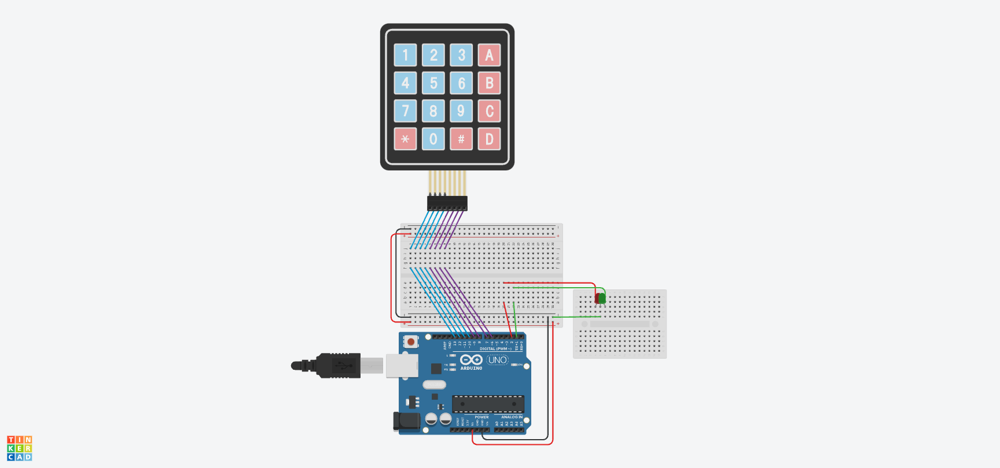
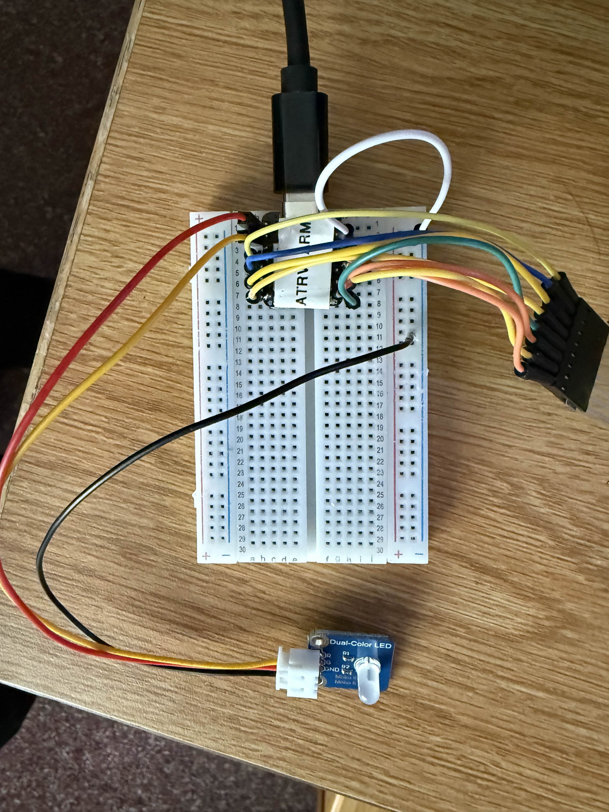
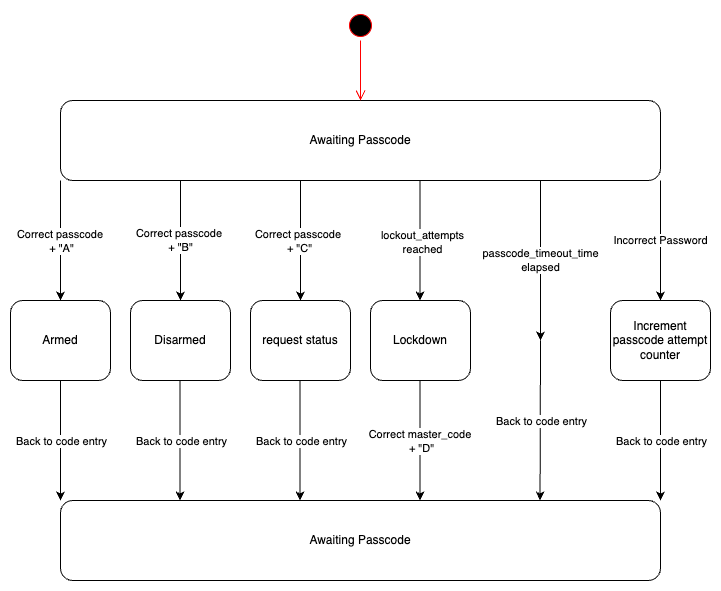

# Keypad Module

A keypad for the security system to allow employees to arm, disarm, request status, and reset the system.

## Table of Contents

- [Configuration Parameters](#configuration-parameters)
- [Input Messages](#input-messages)
- [Output Messages](#output-messages)
- [Hardware Connections](#hardware-connections)
- [Software Design](#software-design)
- [Keypad Mappings](#keypad-mappings)
- [UML Diagram](#uml-diagram)
- [Implementation Notes and Refinements](#implementation-notes-and-refinements)
- [Additional Hardware Considerations](#additional-hardware-considerations)
- [Known Limitations](#known-limitations)
- [Test Cases](#test-cases)
- [User Story](#user-story)

## Configuration Parameters

The keypad module accepts the following configuration parameters via JSON `config` messages:

- `passcode` - String - Sets the passcode to arm/disarm the system (must contain only digits 0-9, A-D, or *)
- `lockout_attempts` - int - Number of wrong passcode attempts before lockdown (must be >= 1)
- `master_code` - String - Master code that will unlock the system to be able to be reset from lockdown (must contain only digits 0-9, A-D, or *)
- `passcode_timeout_time_s` - int - Amount of seconds before the keypad flushes in-progress passcode (must be >= 1)

Example Messages:

- `{ "mtype": "keypad.config", "from": "*", "to": "keypad1", "name": "passcode", "value": "1234" }`
- `{ "mtype": "keypad.config", "from": "*", "to": "keypad1", "name": "lockout_attempts", "value": 5 }`
- `{ "mtype": "keypad.config", "from": "*", "to": "keypad1", "name": "master_code", "value": "1111" }`
- `{ "mtype": "keypad.config", "from": "*", "to": "keypad1", "name": "passcode_timeout_time_s", "value": 10 }`

## Input Messages

The keypad module will process two types of input:

### Keypad Control (Local, Physical Keypad):

Users can enter passcodes followed by action commands:
- `[passcode]A#` - Arm system
- `[passcode]B#` - Disarm system  
- `[passcode]C#` - Request status
- `[master_code]D#` - Reset system (only works when in lockdown)
- `[passcode]#` - Verify passcode without state change

### Admin/Brain Input (JSON):

- **Arm System** - `{ "mtype": "keypad.state", "from": "*", "to": "keypad1", "name": "state", "value": "arm"}`
- **Disarm System** - `{ "mtype": "keypad.state", "from": "*", "to": "keypad1", "name": "state", "value": "disarm"}`
- **Reset System** - `{ "mtype": "keypad.state", "from": "*", "to": "keypad1", "name": "state", "value": "reset"}`
- **Status Request** - `{ "mtype": "keypad.status", "from": "*", "to": "keypad1", "name": "", "value": "" }`
- **Configuration parameters** (as shown above)

## Output Messages

Module outputs based on actions and status changes, all of these will also be displayed through the LEDs:

- **Correct Passcode Entered** - `{ "mtype": "keypad.passcode", "from": "keypad1", "to": "*", "name": "passcode", "value": "correct"}`
- **Incorrect Passcode Entered** - `{ "mtype": "keypad.passcode", "from": "keypad1", "to": "*", "name": "passcode", "value": "incorrect"}`
- **Arm System** - `{ "mtype": "keypad.state", "from": "keypad1", "to": "*", "name": "state", "value": "A"}`
- **Disarm System** - `{ "mtype": "keypad.state", "from": "keypad1", "to": "*", "name": "state", "value": "B"}`
- **Reset from Admin** - `{ "mtype": "keypad.state", "from": "keypad1", "to": "*", "name": "state", "value": "reset"}`
- **Status Message** - `{ "mtype": "keypad.output", "from": "keypad1", "to": "*", "name": "status", "value": "[detailed status string]"}`
- **Debug Messages** - `{ "mtype": "keypad.output", "from": "keypad1", "to": "*", "name": "debug", "value": "[debug message]"}`
- **Error Messages** - `{ "mtype": "keypad.output", "from": "keypad1", "to": "*", "name": "error", "value": "ERROR: [error description]"}`

## Hardware Connections

The hardware needed and how it will be used

### Components:

- [4x4 keypad](https://www.instructables.com/Connecting-a-4-x-4-Membrane-Keypad-to-an-Arduino/)
- [Dual color LED](https://www.sunfounder.com/products/dual-color-led-module?_pos=1&_sid=142998d0b&_ss=r)
- Microcontroller

### LED Feedback:
| Color/State | Meaning |
|--|--|
| Solid Green | Armed |
| Blinking Green | Disarmed |
| Solid Red | Lockdown Mode |
| Brief Green Blink | Key press acknowledgment |
| 3x Green Blinks | Successful operation |
| 3x Red Blinks | Failed operation/incorrect passcode |

Imagine that the small breadboard on the right is the [Dual color LED](https://www.sunfounder.com/products/dual-color-led-module?_pos=1&_sid=142998d0b&_ss=r)


### Component Description

This implementation provides full keypad functionality for a security system. The system reads key presses from a 4x4 matrix keypad, processes passcodes with command suffixes, manages system states, and provides visual feedback through dual-color LEDs.

### Pin Connections

| Component    | Pin Name | Arduino Pin |
| ------------ | -------- | ----------- |
| Keypad Row 1 | R1       | D3          |
| Keypad Row 2 | R2       | D4          |
| Keypad Row 3 | R3       | D5          |
| Keypad Row 4 | R4       | D6          |
| Keypad Col 1 | C1       | D7          |
| Keypad Col 2 | C2       | D8          |
| Keypad Col 3 | C3       | D9          |
| Keypad Col 4 | C4       | D10         |
| Green LED    | +        | D0          |
| Red LED      | +        | D1          |
| LED Common   | -        | GND         |

### Behavior Description

- User enters passcode followed by command letter (A/B/C/D) and `#` to execute
- Green LED provides brief feedback on each key press
- System validates passcode and executes appropriate command
- LEDs indicate system state continuously
- Serial communication handles JSON message processing
- Failed attempts are tracked and can trigger lockdown

### Hardware Setup Photos




## Software Design

### Module Overview:

The keypad module implements a state machine with the following core functionality:

- **Keypad Matrix Scanning**: Custom 4x4 keypad scanning with software debouncing
- **State Management**: Five main states (ARMED, DISARMED, LOCKDOWN, RESET, REPORT_STATUS)
- **Passcode Processing**: Support for variable-length passcodes with command suffixes
- **JSON Communication**: Full ArduinoJSON integration for serial messaging
- **LED Control**: State-based LED management with blink patterns
- **Security Features**: Lockout protection and master code reset capability

### Key Implementation Details:

- **Non-blocking Operation**: Uses millis() for timing instead of blocking delays where possible
- **Input Validation**: Validates all incoming JSON messages and passcode characters
- **Error Handling**: Comprehensive error reporting for malformed inputs
- **Memory Management**: Uses String objects for dynamic passcode handling
- **Debouncing**: 50ms hardware debounce delay for keypad matrix
- **State Persistence**: Maintains previous state for status reporting and recovery

## Keypad Mappings

| Keypad Button  | Function              |
| -------------- | --------------------- |
| `0-9`          | Passcode digits       |
| `A`            | Arm system command    |
| `B`            | Disarm system command |
| `C`            | Request status command|
| `D`            | Reset system command  |
| `*`            | Available for passcode|
| `#`            | Execute/enter command |

### Keypad Layout:
```
1  2  3  A
4  5  6  B  
7  8  9  C
*  0  #  D
```

## UML Diagram

### States:

- `ARMED` - System is armed and monitoring
- `DISARMED` - System is disarmed  
- `LOCKDOWN` - System locked due to failed attempts
- `RESET` - Temporary state to clear failed attempts
- `REPORT_STATUS` - Temporary state to output status information
- `NONE` - Neutral state for transitions



## Implementation Notes and Refinements

### Design Changes:
- **Command Structure**: Instead of entering passcode, then pressing a letter, users now enter `[passcode][command]#` in sequence
- **State Management**: Added `NONE` state to handle clean transitions and the `REPORT_STATUS` state for status requests
- **Timeout Handling**: Passcode timeout automatically clears partial entries without incrementing failure count
- **JSON Validation**: Comprehensive validation of all incoming JSON messages with proper error reporting

### Key Features Added:
- **Input Validation**: `is_valid_passcode()` function ensures only valid characters (0-9, A-D, *) are accepted
- **State History**: Previous state tracking for proper status reporting and recovery
- **Flexible Configuration**: Runtime configuration of all security parameters
- **Debug Output**: Comprehensive debug messaging for system monitoring

### Message Protocol:
- All messages follow the standard format with `mtype`, `from`, `to`, `name`, and `value` fields
- Module only processes messages addressed to its specific ID (`keypad1`, `keypad2`, etc.)
- Error messages provide specific details about validation failures

## Additional Hardware Considerations

### Discovered During Implementation:
- **Keypad Matrix Limitations**: Cannot reliably detect multiple simultaneous key presses (by design)
- **Debouncing Necessity**: Software debouncing with 50ms delay is essential for reliable key detection

### Recommendations:
- Consider adding pull-up resistors on keypad rows if experiencing phantom key presses

## Known Limitations

### Current Implementation Limitations:
1. **Memory Usage**: Uses Arduino String class which can cause heap fragmentation on long-running systems
2. **No Persistent Storage**: Configuration is lost on power cycle; all settings must be resent
3. **Serial Communication Only**: No wireless or network connectivity options
4. **Single Keypad Support**: Each module instance only supports one physical keypad
5. **No Key Repeat Prevention**: Long key presses are handled by debouncing but could be improved with state tracking

### Potential Improvements:
- Add EEPROM storage for configuration persistence  
- Implement key repeat detection and prevention

## Test Cases

### Configuration Tests

**T-CONFIG-01** - Set Valid Passcode
- **Description**: Verify passcode configuration with valid characters
- **Input**: `{ "mtype": "keypad.config", "from": "*", "to": "keypad1", "name": "passcode", "value": "1234A" }`
- **Expected Output**: `keypad.passcode` message: "Passcode successfully set: 1234A"
- **Oracle**: Configuration accepted and stored

**T-CONFIG-02** - Set Invalid Passcode  
- **Description**: Verify rejection of invalid passcode characters
- **Input**: `{ "mtype": "keypad.config", "from": "*", "to": "keypad1", "name": "passcode", "value": "12E4" }`
- **Expected Output**: `keypad.output` error message: "ERROR: Value is not valid."
- **Oracle**: Configuration rejected, previous passcode unchanged

**T-CONFIG-03** - Set Master Code
- **Description**: Verify master code configuration
- **Input**: `{ "mtype": "keypad.config", "from": "*", "to": "keypad1", "name": "master_code", "value": "9999" }`
- **Expected Output**: `keypad.output` debug message: "Master code successfully set: 9999"
- **Oracle**: Master code stored and ready for lockdown reset

**T-CONFIG-04** - Set Lockout Attempts
- **Description**: Verify lockout attempts configuration
- **Input**: `{ "mtype": "keypad.config", "from": "*", "to": "keypad1", "name": "lockout_attempts", "value": 3 }`
- **Expected Output**: `keypad.output` debug message: "Lockout attempts successfully set: 3"
- **Oracle**: Lockout threshold updated

**T-CONFIG-05** - Set Invalid Lockout Attempts
- **Description**: Verify rejection of invalid lockout attempts
- **Input**: `{ "mtype": "keypad.config", "from": "*", "to": "keypad1", "name": "lockout_attempts", "value": 0 }`
- **Expected Output**: `keypad.output` error message: "ERROR: Value is not an integer."
- **Oracle**: Configuration rejected

**T-CONFIG-06** - Set Timeout Period
- **Description**: Verify passcode timeout configuration
- **Input**: `{ "mtype": "keypad.config", "from": "*", "to": "keypad1", "name": "passcode_timeout_time_s", "value": 15 }`
- **Expected Output**: `keypad.output` debug message: "Passcode_timeout_time_s successfully set: 15000"
- **Oracle**: Timeout set to 15000ms (15 seconds)

### Input Message Tests

**T-INPUT-01** - Correct Passcode Only
- **Setup**: Configure passcode as "1234"
- **Description**: Test basic passcode validation
- **Keypad Input**: `1`, `2`, `3`, `4`, `#`
- **Expected Output**: `keypad.passcode` message with value "correct", 3x green LED blinks
- **Oracle**: Passcode validated successfully, no state change

**T-INPUT-02** - Incorrect Passcode
- **Setup**: Configure passcode as "1234"  
- **Description**: Test passcode rejection and failure tracking
- **Keypad Input**: `5`, `6`, `7`, `8`, `#`
- **Expected Output**: `keypad.passcode` message with value "incorrect", 3x red LED blinks
- **Oracle**: Failed attempt counter incremented

**T-INPUT-03** - Arm System via Keypad
- **Setup**: Configure passcode as "1234", system in DISARMED state
- **Description**: Test arming system with passcode + command
- **Keypad Input**: `1`, `2`, `3`, `4`, `A`, `#`
- **Expected Output**: `keypad.state` message with value "A", system enters ARMED state, 3x green blinks
- **Oracle**: System state changed to ARMED, LED shows solid green

**T-INPUT-04** - Disarm System via Keypad  
- **Setup**: Configure passcode as "1234", system in ARMED state
- **Description**: Test disarming system with passcode + command
- **Keypad Input**: `1`, `2`, `3`, `4`, `B`, `#`
- **Expected Output**: `keypad.state` message with value "B", system enters DISARMED state, 3x green blinks
- **Oracle**: System state changed to DISARMED, LED shows blinking green

**T-INPUT-05** - Request Status via Keypad
- **Setup**: Configure passcode as "1234"
- **Description**: Test status request functionality
- **Keypad Input**: `1`, `2`, `3`, `4`, `C`, `#`
- **Expected Output**: `keypad.output` status message with detailed system information, 3x green blinks
- **Oracle**: Detailed status output including current state, configuration, and attempt counts

**T-INPUT-06** - Admin Arm Command
- **Description**: Test JSON state control from admin/brain
- **Input**: `{ "mtype": "keypad.state", "from": "*", "to": "keypad1", "name": "state", "value": "arm" }`
- **Expected Output**: `keypad.state` message confirming arm state, LED shows solid green
- **Oracle**: System enters ARMED state without requiring passcode

**T-INPUT-07** - Admin Status Request
- **Description**: Test JSON status request from admin/brain
- **Input**: `{ "mtype": "keypad.status", "from": "*", "to": "keypad1", "name": "", "value": "" }`
- **Expected Output**: `keypad.output` status message with complete system information
- **Oracle**: Comprehensive status report generated

**T-INPUT-08** - Passcode Timeout
- **Setup**: Configure passcode timeout to 5 seconds
- **Description**: Test automatic clearing of partial passcode entry
- **Keypad Input**: `1`, `2` [wait 6 seconds], `3`, `4`, `#`
- **Expected Output**: `keypad.passcode` message "incorrect" (since "34" ≠ "1234")
- **Oracle**: Partial entry cleared after timeout, no failure count increment for timeout

### Error Handling Tests

**T-ERROR-01** - Malformed JSON Structure
- **Description**: Test handling of invalid JSON syntax
- **Input**: `{ "mtype": "keypad.config", "from": "*", "to": "keypad1", "name": "passcode" "value": "1234" }`
- **Expected Output**: `keypad.output` error message with JSON parsing error details
- **Oracle**: Error detected and reported, system continues normal operation

**T-ERROR-02** - Missing Required JSON Fields
- **Description**: Test validation of required message fields
- **Input**: `{ "mtype": "keypad.config", "from": "*", "name": "passcode", "value": "1234" }`
- **Expected Output**: `keypad.output` error message: "ERROR: JSON message is missing a key."
- **Oracle**: Message rejected due to missing "to" field

**T-ERROR-03** - Invalid Message Type
- **Description**: Test rejection of unsupported message types
- **Input**: `{ "mtype": "invalid.type", "from": "*", "to": "keypad1", "name": "test", "value": "test" }`
- **Expected Output**: `keypad.output` error message: "ERROR: JSON does not contain proper value for 'mtype' key."
- **Oracle**: Message rejected due to invalid mtype

**T-ERROR-04** - Wrong Destination Address
- **Description**: Test message filtering by destination
- **Input**: `{ "mtype": "keypad.config", "from": "*", "to": "keypad2", "name": "passcode", "value": "1234" }`
- **Expected Output**: No response (message silently ignored)
- **Oracle**: Message ignored due to wrong destination address

**T-ERROR-05** - Boolean Value Rejection
- **Description**: Test rejection of boolean values where strings expected
- **Input**: `{ "mtype": "keypad.config", "from": "*", "to": "keypad1", "name": "passcode", "value": true }`
- **Expected Output**: `keypad.output` error message: "ERROR: Value can not be a boolean."
- **Oracle**: Boolean values properly rejected

**T-ERROR-06** - Lockdown Scenario and Recovery
- **Setup**: Configure lockout_attempts to 2, master_code to "9999"
- **Description**: Test lockdown trigger and master code recovery
- **Sequence**:
  1. Enter wrong passcode twice: `5555#`, `6666#`
  2. System should enter LOCKDOWN state
  3. Enter master code with reset: `9999D#`
- **Expected Output**: 
  - After 2nd wrong entry: Lockdown state, solid red LED
  - After master reset: `keypad.state` message "reset", return to ARMED state
- **Oracle**: Lockdown properly triggered and recovered using master code

**T-ERROR-07** - No Passcode Configured
- **Description**: Test behavior when no passcode is set
- **Setup**: Fresh system with no passcode configured
- **Keypad Input**: `1`, `2`, `3`, `4`, `#`
- **Expected Output**: `keypad.output` error message: "ERROR: No passcode has been set yet."
- **Oracle**: System prevents operation without configured passcode

**T-ERROR-08** - Invalid Reset Attempt
- **Description**: Test reset command when not in lockdown
- **Setup**: System in normal ARMED state, master_code "9999"
- **Keypad Input**: `9`, `9`, `9`, `9`, `D`, `#`
- **Expected Output**: `keypad.output` error message: "ERROR: System is not in lockdown.", 3x red LED blinks
- **Oracle**: Reset command rejected when system not in lockdown state

## User Story

As an Employee I want to be able to arm and disarm the system and be able to see its status

### Implementation Location:
This module is implemented in the `embedded/keypad/` folder as part of the larger embedded security system project.

### Integration Notes:
- Communicates via serial JSON messages with the main system brain
- Supports multiple keypad instances with unique IDs (keypad1, keypad2, etc.)
- Designed for integration with other security system modules
- Follows established JSON messaging protocol for system-wide compatibility

**GitHub Issue**: https://github.com/ComputerScienceUniversityofDenver/S25-EmbeddedSecuritySystem/issues/10